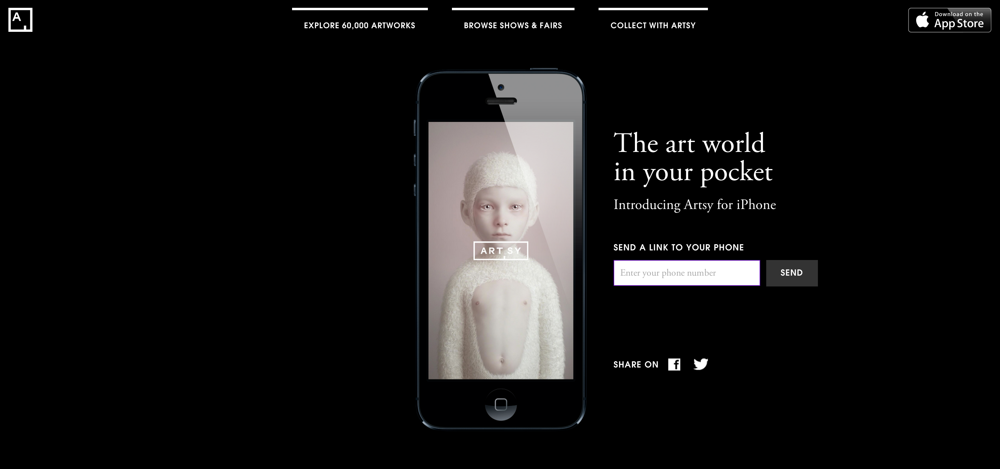

Flare
=====

Artsy's iPhone app launch marketing splash page.

### Meta

- **State:** production
- **Point People:** [@ashfurrow](https://github.com/ashfurrow)
- **Heroku Project:** [flare-production](https://dashboard.heroku.com/apps/flare-production/)
- **CI:** 

### Demo

Check it out on [iphone.artsy.net](http://iphone.artsy.net). Scroll down and watch the inside of the iPhone animate.

### Developer Documentation

Please see the [doc folder](https://github.com/artsy/flare/tree/master/doc) for help, a good place to start is [getting_started.md](https://github.com/artsy/flare/blob/master/doc/getting_started.md).

**Note**: To update the URL that users are directed to when they click the app-download link, edit the `CANONICAL_URL` environment variable in Heroku.

### License

MIT License, see [LICENSE](LICENSE.md) for details.
